  

<h1 align="center">Hi, I'm Pranav 👋</h1>

<h3 align="center">Computer Engineering Student · Web Developer · Core Java · Researcher</h3>

  

  
  
  
  

---

👋 Hi! I'm **Pranav Peshkar**, a final-year Computer Engineering student at **SPPU, Pune, India**. I build full-stack web applications from the database up: PHP and MySQL backends, plain HTML/CSS/JS frontends, and Core Java systems with JDBC. I also research privacy-preserving machine learning, and my paper on federated learning in smart healthcare is published on IEEE Xplore.

- 🔨 Building **ParentSphere 2.0**, a college-wide student management system with role-based access
- ☕ Built a **Library Management System** in Core Java with a custom HTTP server
- 📄 Published research on **federated learning for privacy-preserving healthcare diagnosis**
- 🧩 Practicing data structures and algorithms on LeetCode
- 🔐 Interested in privacy-preserving ML: federated learning, differential privacy, cryptography
- 📫 Open to software development opportunities

---

## Skills 

| Category | Skills |
| :--- | :--- |
| **Languages** |      |
| **Web & Databases** |     |
| **ML / Computer Vision** |        |
| **Research & Security** |    |
| **Core Concepts** |     |
| **Tools** |   |
| **Competitive Coding** |  |

---

## Projects 🚀

| Project | What it is | Tech |
| :--- | :--- | :--- |
| [**Library Management System**](https://github.com/pranavpeshkar7/Library_Management) | Built a full-stack library system in core Java with no frameworks: a custom HTTP server and REST API (GET, POST, PUT, DELETE) over MySQL using JDBC, with role-based access for students, teachers and librarians. Applied OOP and multithreading to make concurrent borrowing safe and enforce role based limits. |    |
| [**SecureChat**](https://github.com/pranavpeshkar7/SecureChat) | Built a secure chat application using RSA for key exchange and AES for message encryption. Implemented secure authentication, session management, and encrypted data storage so that only authorized users can access their conversations. |     |
| [**ParentSphere**](https://github.com/pranavpeshkar7/ParentSphere) | Built a full-stack student–parent–teacher management platform with role based dashboards for each user type. Implemented leave-request workflows, test-marks tracking, and assignment management with full CRUD functionality. |    |

---

## Research 📄

### [Federated Learning in Smart Healthcare with Optimized History-Based Diagnosis](https://ieeexplore.ieee.org/document/11493199)

Hospitals usually train diagnostic models on raw patient data, which puts patient privacy at risk. This paper proposes a federated learning approach that combines history taking through interactions with diagnosis, so models keep learning from every interaction while only model updates, never raw data, reach the central server. Privacy is protected using mixed update sending, differential privacy, secure aggregation and update clipping.

   

<b>Read the abstract</b>

 

Federated Learning is a new approach used to train multiple machine learning models without raw patient data or a centralized system. This paper proposes a new federated learning methodology combined with history taking through interactions, taking diagnosis a step further. When training a new model, hospitals and medical institutions use raw patient data to train and update the accuracy of their models, which can hamper patient privacy. Federated learning is a self-learning method that lets models learn continuously from every interaction and pass only model updates to the central server. Implemented at scale, it can significantly enhance the accuracy and processing time of diagnosis. Because federated learning has to be updated continuously with different situations, privacy becomes a real concern. The proposed method uses mixed update sending, differential privacy, secure aggregation and update clipping, which makes it more shielded, robust and dynamic. With this, dynamic processing and privacy can coexist.

📖 [Read the full paper on IEEE Xplore](https://ieeexplore.ieee.org/document/11493199)

---

## 🧱 Commit Brick Breaker

Every square in my contribution graph is a brick. Each commit I push makes the game harder to finish, and it updates itself every hour.

  

⭐ If you like something here, drop a star on the repo!

